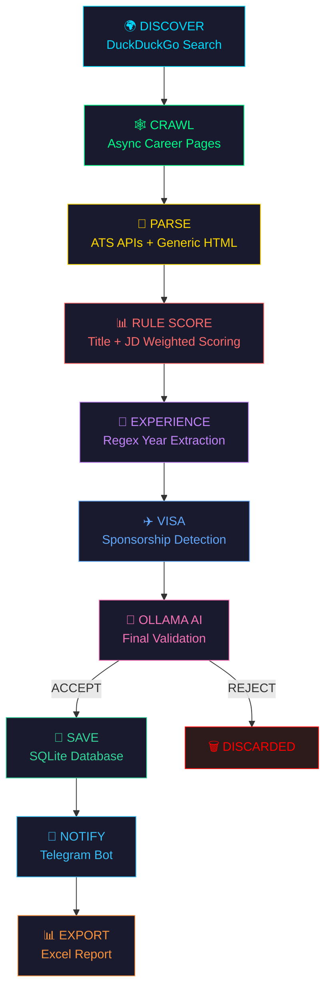

<p align="center">
  
</p>

<p align="center">
  
</p>

<p align="center">
  <a href="#"></a>
  <a href="#"></a>
  <a href="#"></a>
  <a href="#"></a>
  <a href="#"></a>
  <a href="#"></a>
</p>

<p align="center">
  
  
  
  
  
</p>

---

## 🤔 The Problem

> *"I just graduated with a B.Tech in CSE (AI & ML)... and LinkedIn thinks I need 10 years of experience to be a 'Junior Developer'."*

Sound familiar? You spend hours scrolling through job boards, only to find:

- 🧓 "Junior" roles that want 5+ years of experience *(sir, that's a senior role in disguise)*
- 🌍 International roles with zero visa info *(surprise! figure it out yourself)*
- 📬 The same 20 jobs recycled across 5 platforms
- 🤖 Generic "software engineer" listings that are actually for COBOL maintenance

**This agent was born out of pure frustration.** It doesn't just scrape — it **hunts**, **thinks**, and **validates** using AI.

---

## 🧠 What Makes This Different?

<table>
<tr>
<td width="50%">

### ❌ Normal Job Scrapers
```
1. Hit LinkedIn API
2. Get 50 results
3. Dump to spreadsheet
4. Cry
```

</td>
<td width="50%">

### ✅ This Agent
```
1. Discover the ENTIRE web
2. Crawl any career page
3. Score with 4-layer filter
4. Ask AI: "Is this ACTUALLY junior?"
5. Get Telegram ping 📱
6. Apply while sipping chai ☕
```

</td>
</tr>
</table>

---

## 🏗️ Architecture — The Brain

<p align="center">
  
</p>



> *Think of it as a 10-stage interview... but for jobs. Only the worthy survive.* 💀

---

## 📂 Project Structure

```
job-agent/
│
├── 🧠 main.py                          # The brain — runs the 10-step pipeline
├── ⚙️ config.py                         # All settings, API keys, thresholds
├── 📦 requirements.txt                  # Dependencies
├── 🗄️ jobs.db                           # SQLite database (auto-created)
├── 📊 jobs_export.xlsx                  # Daily Excel export
├── 🔒 .env                             # Secrets (API keys, Telegram token)
│
└── modules/
    ├── 🌍 discovery/
    │   └── web_discovery.py             # DuckDuckGo → find career domains
    │
    ├── 🕸️ crawling/
    │   └── career_crawler.py            # Async aiohttp → detect career pages
    │
    ├── 🧩 parsing/
    │   ├── greenhouse.py                # Greenhouse ATS API
    │   ├── lever.py                     # Lever ATS API
    │   ├── ashby.py                     # Ashby GraphQL API
    │   ├── workable.py                  # Workable REST API
    │   └── generic_html.py              # Parse ANY career page on the web
    │
    ├── 🎯 filtering/
    │   ├── rule_scoring.py              # Weighted title + JD scoring
    │   ├── experience_parser.py         # Years extraction, intern auto-pass
    │   ├── visa_filter.py               # Sponsorship scoring
    │   └── ollama_validator.py          # 🤖 Local AI — final authority
    │
    ├── 📱 notifier.py                   # Telegram bot notifications
    ├── 📊 exporter.py                   # Excel export
    └── 💾 tracker.py                    # SQLite database layer
```

> *"But wait, wasn't this all in one 1700-line file before?"*
>
> **Yes. We don't talk about that anymore.** 🫣

---

## 🎯 The Scoring System — How Jobs Get Judged

Every job goes through a **courtroom trial** before it reaches your Telegram:

### 📋 Title Scoring

| Signal | Points | Example |
|--------|--------|---------|
| `internship` / `intern` | **+4** | ✅ "Software Engineering Intern" |
| `graduate` / `junior` | **+3** | ✅ "Graduate Backend Developer" |
| `associate` / `entry level` | **+2** | ✅ "Associate Engineer" |
| `software engineer` | **+1** | ✅ "Software Engineer" |
| `senior` / `staff` / `lead` | **-6** | ❌ "Senior Staff Engineer" |
| `director` / `manager` | **-6** | ❌ "Director of Engineering" |
| `principal` / `architect` | **-6** | ❌ "Principal Architect" |

### 📄 JD Text Scoring

| Signal | Points |
|--------|--------|
| `"internship"` in JD | **+3** |
| `"0-2 years"` / `"new grad"` | **+2** |
| `"5+ years"` / `"7+ years"` | **-4** |
| `"technical leadership"` | **-3** |
| `"managed a team"` | **-4** |

> **Verdict: ACCEPT if score ≥ 2.** Anything below? 🔨 *REJECTED.*

### Real Examples:

```
"Senior Staff Engineer"     → Score: -17  → 🗑️ OBLITERATED
"Software Engineering Intern" → Score: +12  → ✅ WELCOME ABOARD
"Junior Backend Developer"  → Score: +7   → ✅ COME ON IN
"Director of Engineering"   → Score: -8   → 🗑️ NICE TRY
```

> *The scoring system has no chill. Exactly how we like it.* 😤

---

## 🤖 The AI Layer — Ollama Validation

After surviving the scoring gauntlet, every job faces **one final boss**:

```
┌─────────────────────────────────────────────────┐
│  🧠 LOCAL OLLAMA (LLaMA 3)                      │
│                                                  │
│  "Is this job ACTUALLY suitable for a            │
│   2025 B.Tech CSE graduate?"                     │
│                                                  │
│  → Analyzes title + 2000 chars of JD             │
│  → Returns: ACCEPT/REJECT + confidence %         │
│  → Results cached in SQLite (no re-processing)   │
│  → Graceful fallback if offline                  │
│                                                  │
│  🔌 Runs 100% locally. No cloud. No API bills.   │
└─────────────────────────────────────────────────┘
```

> *"So the AI checks if a job is junior... using AI that runs on my laptop?"*
>
> **Yes. The future is now, old man.** 🧓→🤖

---

## 🌍 Coverage — We Scrape EVERYWHERE

### ATS Platforms (500+ companies)

| Platform | Companies | Method |
|----------|-----------|--------|
| 🌿 **Greenhouse** | OpenAI, Stripe, Vercel, Notion, Figma... | REST API |
| ⚙️ **Lever** | Netflix, Dropbox, Atlassian, MongoDB... | REST API |
| 🔷 **Ashby** | Anthropic, Cursor, Supabase, Linear... | GraphQL |
| 🔧 **Workable** | Revolut, Monzo, Spotify, GitLab... | REST API |
| 🌐 **JobSpy** | LinkedIn + Indeed aggregation | python-jobspy |

### 🌍 Web Discovery (Infinite!)

```
DuckDuckGo → "junior software engineer careers" 
           → finds: randomstartup.com/careers
           → crawls: /careers, /jobs, /internships
           → parses: job title, JD, location
           → filters: score → experience → visa → AI
           → 📱 Telegram: "New job found!"
```

### 🗺️ Countries Covered

```
🇮🇳 India (primary)          🇬🇧 UK              🇩🇪 Germany
🇳🇱 Netherlands              🇮🇪 Ireland          🇦🇪 UAE
🇸🇪 Sweden                   🇨🇦 Canada           🇦🇺 Australia
🇸🇬 Singapore                🇯🇵 Japan            🇵🇹 Portugal
🇨🇿 Czech Republic           🇷🇴 Romania          🇩🇰 Denmark
🇫🇮 Finland                  🇳🇴 Norway           🇨🇭 Switzerland
🇦🇹 Austria                  🇧🇪 Belgium          🇰🇷 South Korea
🇹🇼 Taiwan                   🇭🇰 Hong Kong        🇮🇱 Israel
🇧🇷 Brazil                   🇲🇽 Mexico           🇦🇷 Argentina
🌐 Remote                    🇵🇱 Poland           🇪🇸 Spain
```

> *30+ countries. Because your dream job might be in Helsinki and you just don't know it yet.* 🇫🇮

---

## ✈️ Visa Intelligence

Not all jobs are created equal when you're international:

| Scenario | Action |
|----------|--------|
| 🇮🇳 India job | ✅ Auto-pass (no visa needed) |
| 🌐 Remote internship | ✅ Auto-pass |
| "Visa sponsorship available" | ✅ **+3 points** |
| "Relocation support" | ✅ **+1 point** |
| "Must have work authorization" | ❌ **-3 points** |
| "No sponsorship" | ❌ **-5 points** |

> *The visa filter is basically your immigration lawyer, but free and runs at 3 AM.* ⚖️

---

## 🔎 Experience Parser — The BS Detector

Companies love to hide experience requirements in walls of text. Not anymore:

```python
"5+ years of experience"      → Detected: 5 years → ❌ REJECTED
"0-2 years"                   → Detected: 2 years → ✅ PASSED
"minimum 7 years"             → Detected: 7 years → ❌ REJECTED
"No experience required"      → Detected: 0 years → ✅ PASSED
"Intern" + "5+ years in JD"   → 🎓 INTERN AUTO-PASS → ✅ PASSED
```

> *An intern role asking for 5+ years? That's their problem, not ours.* 😂

---

## 🚀 Quick Start

### Prerequisites

```bash
# Python 3.11+
python3 --version

# Ollama (local AI)
ollama --version
ollama pull llama3
```

### Installation

```bash
# Clone
git clone https://github.com/yourusername/job-agent.git
cd job-agent

# Virtual environment
python3 -m venv venv
source venv/bin/activate   # macOS/Linux
# venv\Scripts\activate    # Windows

# Install dependencies
pip install -r requirements.txt
```

### Configuration

Create `.env` file:

```env
# Telegram Bot (get from @BotFather)
TELEGRAM_TOKEN=your_telegram_bot_token
TELEGRAM_CHAT_ID=your_chat_id

# Your Info
APPLICANT_NAME=Your Name
APPLICANT_EMAIL=you@email.com
APPLICANT_PHONE=1234567890
APPLICANT_LINKEDIN=https://linkedin.com/in/you
APPLICANT_GITHUB=https://github.com/you
APPLICANT_LOCATION=Your City, Country

# Settings
DAILY_TARGET=250
MIN_HR_SCORE=70
OLLAMA_MODEL=llama3:latest
```

### Run

```bash
# Make sure Ollama is running
ollama serve &

# Launch the agent 🚀
python main.py
```

<p align="center">
  
</p>

---

## 📊 Database Schema

```sql
-- 💾 Jobs (the main event)
jobs (
    id, job_title, company, country, job_url,
    visa_sponsorship, hr_score, relevance_score,
    status, source, date_found, jd_content, ...
)

-- 🌍 Discovered Domains (web discovery cache)
discovered_domains (
    domain, company_name, career_url,
    source_query, is_ats, last_crawled, job_count
)

-- 🤖 AI Validation Cache (no duplicate AI calls)
ai_validation_cache (
    job_hash, decision, confidence, reason, validated_at
)

-- 📈 Daily Stats
daily_stats (
    date, total_found, total_applied,
    india_applied, international_applied, ...
)
```

---

## 🛠️ Tech Stack

<p align="center">

| Layer | Technology | Why |
|-------|-----------|-----|
| 🐍 Language | Python 3.11+ | Because we're not animals |
| 🤖 AI | Ollama + LLaMA 3 | Local, free, no API bills |
| 🌐 Discovery | DuckDuckGo Search | No API key needed |
| 🕸️ Crawling | aiohttp (async) | Fast concurrent crawling |
| 🧩 Parsing | BeautifulSoup4 | HTML parsing Swiss army knife |
| 📡 ATS APIs | Greenhouse, Lever, Ashby, Workable | Direct API access |
| 🔍 Job Boards | python-jobspy | LinkedIn + Indeed |
| 💾 Database | SQLite | Zero config, portable |
| 📱 Notifications | python-telegram-bot | Real-time alerts |
| 📊 Export | openpyxl | Excel reports |
| 🔐 Config | python-dotenv | Environment variables |

</p>

---

## ⏰ How It Works (A Day in the Life)

```
🌅 6:00 AM — You're sleeping. The agent is not.

  🔁 Scan cycle #47 started...
  
  🌍 DISCOVER: Searching DuckDuckGo for "junior software engineer careers"
      🆕 Found: coolstartup.io
      🆕 Found: techcompany.dev
  
  🕸️ CRAWL: Checking coolstartup.io/careers...
      ✅ Found 3 job links
  
  🧩 PARSE: Extracting from Greenhouse, Lever, Ashby, Workable...
      📊 Total raw: 847 jobs | Deduped: 412
  
  🎯 FILTER:
      📊 Rule scoring: 312 rejected (too senior)
      🔎 Experience: 28 rejected (3+ years required)  
      ✈️ Visa: 19 rejected (no sponsorship)
      🤖 Ollama: 8 rejected (AI said NOPE)
  
  ✅ 45 jobs passed all filters!
  
  💾 Saved 12 new jobs (33 were duplicates)
  📱 Telegram: 12 notifications sent
  📊 Excel exported: jobs_export.xlsx
  
  ⏳ Sleeping 2 minutes...

🌅 6:02 AM — Cycle #48 begins. You're still sleeping. Living your best life.
```

> *The agent has applied to more jobs before breakfast than most people do in a week.* 🏆

---

## 🔧 Configuration Deep Dive

### Filtering Thresholds (`config.py`)

```python
MIN_RULE_SCORE = 2          # Minimum weighted score to pass
MAX_EXPERIENCE_YEARS = 3    # Reject if JD needs >= 3 years
SCAN_INTERVAL_SECONDS = 120 # Time between scan cycles
CRAWL_MAX_DOMAINS = 30      # Domains per crawl cycle
CRAWL_CONCURRENCY = 10      # Parallel async requests
DISCOVERY_BATCH_SIZE = 15   # DDG queries per cycle
```

### Target Roles

```python
TARGET_LEVELS = [
    "Intern", "Internship", "Junior", "Graduate",
    "Entry Level", "Fresher", "New Grad", "Trainee",
    "Associate", "Early Career", "Apprentice",
]
```

> *Notice how "Senior" is NOT on this list. That's not an accident.* 🎯

---

## 📱 Telegram Alerts

Every new valid job triggers a Telegram message:

```
🚀 New Job Found!

🏢 Company: OpenAI
💼 Role: Software Engineering Intern
🌍 Location: San Francisco, CA
📡 Source: greenhouse
✈️ Visa: sponsored
🔗 Apply Here

Score: 12 | AI: 95% | "Entry-level intern role, perfect for 2025 graduate"
```

---

## 🧪 Verified & Tested

| Test Suite | Status | Details |
|------------|--------|---------|
| All Imports (11 modules) | ✅ PASS | Every module loads cleanly |
| Rule Scoring (5 cases) | ✅ PASS | Senior=-17, Intern=+12, Junior=+7 |
| Experience Parser (5 cases) | ✅ PASS | Intern auto-pass, 5+ years reject |
| Visa Filter (4 cases) | ✅ PASS | India auto-pass, no-sponsor reject |
| DB Migration | ✅ PASS | New tables + columns confirmed |

---

## 🗺️ Roadmap

- [x] 🌍 Global web discovery via DuckDuckGo
- [x] 🕸️ Async career page crawler
- [x] 🤖 Local AI validation with Ollama
- [x] 🎯 4-layer filtering pipeline
- [x] 📱 Telegram notifications
- [x] 📊 Excel export
- [ ] 🤖 Auto-apply with AI-generated cover letters
- [ ] 📄 AI resume tailoring per job
- [ ] 📈 Web dashboard with analytics
- [ ] 🔔 Slack/Discord integration
- [ ] 🌐 Multi-language support

---

## ⚠️ Disclaimer

> This tool is for **educational and personal use**. Be respectful of rate limits and terms of service. The author is not responsible for any bans, rejections, or existential crises caused by seeing how many jobs exist that you're qualified for but didn't know about.

---

## 👨‍💻 Author

**Arshad Uzzama Shaik**

- 🎓 B.Tech CSE — AI & ML (2025 Graduate)
- 🔗 [LinkedIn](https://www.linkedin.com/in/arshad-uzzama-shaik-3b767424b/)
- 🐙 [GitHub](https://github.com/arshadshaik0000)

---

<p align="center">
  
</p>

<p align="center">
  <b>⭐ Star this repo if you think job boards should fear AI ⭐</b>
</p>
