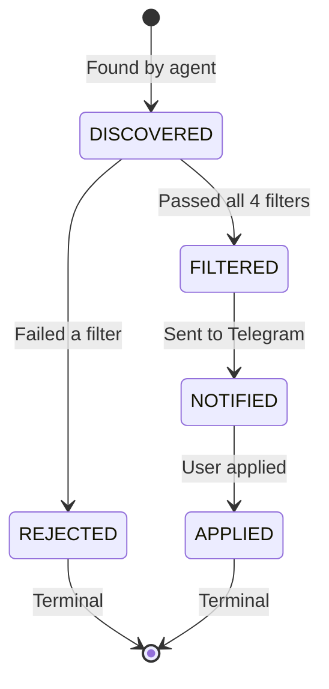

<!-- ═══════════════════════════════════════════════════════════════════ -->
<!-- 🎨 ANIMATED HEADER BANNER                                         -->
<!-- ═══════════════════════════════════════════════════════════════════ -->

<p align="center">
  
</p>

<!-- ═══════════════════════════════════════════════════════════════════ -->
<!-- 🔗 NAVIGATION BADGES                                              -->
<!-- ═══════════════════════════════════════════════════════════════════ -->

<p align="center">
  <a href="#-quick-start"></a>
  <a href="#️-architecture--the-brain"></a>
  <a href="#-the-scoring-system--how-jobs-get-judged"></a>
  <a href="#-the-ai-layer--ollama-validation"></a>
  <a href="#-coverage--we-scrape-everywhere"></a>
</p>

<!-- ═══════════════════════════════════════════════════════════════════ -->
<!-- 🏷️ TECH BADGES                                                    -->
<!-- ═══════════════════════════════════════════════════════════════════ -->

<p align="center">
  
  
  
  
  
  
</p>

<p align="center">
  
  
  
  
  
</p>

<!-- ═══════════════════════════════════════════════════════════════════ -->
<!-- ⌨️ TYPING ANIMATION                                               -->
<!-- ═══════════════════════════════════════════════════════════════════ -->

<p align="center">
  
</p>

---

<!-- ═══════════════════════════════════════════════════════════════════ -->
<!-- 🤔 THE PROBLEM                                                    -->
<!-- ═══════════════════════════════════════════════════════════════════ -->

##  The Problem

> *"I just graduated with a B.Tech in CSE (AI & ML)... and LinkedIn thinks I need 10 years of experience to be a 'Junior Developer'."*

Sound familiar? You spend hours scrolling through job boards, only to find:

<table>
<tr>
<td>🧓</td><td><strong>"Junior" roles</strong> that want 5+ years of experience <em>(sir, that's a senior role in disguise)</em></td>
</tr>
<tr>
<td>🌍</td><td><strong>International roles</strong> with zero visa info <em>(surprise! figure it out yourself)</em></td>
</tr>
<tr>
<td>📬</td><td><strong>The same 20 jobs</strong> recycled across 5 platforms</td>
</tr>
<tr>
<td>🤖</td><td><strong>Generic listings</strong> that are actually for COBOL maintenance</td>
</tr>
</table>

**This agent was born out of pure frustration.** It doesn't just scrape — it **hunts**, **thinks**, and **validates** using AI.

---

## ✨ What Makes This Different?

<table>
<tr>
<td width="50%">

### ❌ Normal Job Scrapers
```
1. Hit LinkedIn API
2. Get 50 results
3. Dump to spreadsheet
4. Cry
```

</td>
<td width="50%">

### ✅ This Agent
```
1. Discover the ENTIRE web
2. Crawl any career page
3. Score with 4-layer filter
4. Ask AI: "Is this ACTUALLY junior?"
5. Get Telegram ping 📱
6. Apply while sipping chai ☕
```

</td>
</tr>
</table>

<details>
<summary><strong>🏆 Full Capability Matrix (click to expand)</strong></summary>
<br>

| Capability | Description | Module |
|:-----------|:------------|:-------|
| 🌍 **Web Discovery** | Finds career pages via DuckDuckGo | `web_discovery.py` |
| 🕸️ **Async Crawling** | Concurrent career page crawling | `career_crawler.py` |
| 🧩 **Multi-ATS Parsing** | Greenhouse, Lever, Ashby, Workable | `parsing/*.py` |
| 🌐 **Generic HTML** | Parse ANY career page on the web | `generic_html.py` |
| 📊 **Rule Scoring** | Weighted title + JD scoring | `rule_scoring.py` |
| 🔎 **Experience Parse** | Regex year extraction + intern auto-pass | `experience_parser.py` |
| ✈️ **Visa Filter** | Sponsorship detection & scoring | `visa_filter.py` |
| 🤖 **AI Validation** | Final boss — local Ollama LLaMA3 | `ollama_validator.py` |
| 💾 **Database** | SQLite with dedup + caching | `tracker.py` |
| 📱 **Notifications** | Real-time Telegram alerts | `notifier.py` |
| 📊 **Export** | Daily Excel reports | `exporter.py` |

</details>

---

## 🏗️ Architecture — The Brain

```mermaid
graph TD
    A["🌍 DISCOVER<br/>DuckDuckGo Search"] --> B["🕸️ CRAWL<br/>Async Career Pages"]
    B --> C["🧩 PARSE<br/>ATS APIs + Generic HTML"]
    C --> D["📊 RULE SCORE<br/>Title + JD Weighted Scoring"]
    D --> E["🔎 EXPERIENCE<br/>Regex Year Extraction"]
    E --> F["✈️ VISA<br/>Sponsorship Detection"]
    F --> G["🤖 OLLAMA AI<br/>Final Validation"]
    G -->|ACCEPT| H["💾 SAVE<br/>SQLite Database"]
    G -->|REJECT| X["🗑️ DISCARDED"]
    H --> I["📱 NOTIFY<br/>Telegram Bot"]
    I --> J["📊 EXPORT<br/>Excel Report"]

    style A fill:#1a1a2e,stroke:#00d9ff,color:#00d9ff
    style B fill:#1a1a2e,stroke:#00ff88,color:#00ff88
    style C fill:#1a1a2e,stroke:#ffd700,color:#ffd700
    style D fill:#1a1a2e,stroke:#ff6b6b,color:#ff6b6b
    style E fill:#1a1a2e,stroke:#c084fc,color:#c084fc
    style F fill:#1a1a2e,stroke:#60a5fa,color:#60a5fa
    style G fill:#1a1a2e,stroke:#f472b6,color:#f472b6
    style H fill:#1a1a2e,stroke:#34d399,color:#34d399
    style I fill:#1a1a2e,stroke:#38bdf8,color:#38bdf8
    style J fill:#1a1a2e,stroke:#fb923c,color:#fb923c
    style X fill:#2d1b1b,stroke:#ff0000,color:#ff0000
```

<p align="center">
  
</p>



> *Think of it as a 10-stage interview... but for jobs. Only the worthy survive.* 💀

<details>
<summary><strong>🔰 Explain this to me like I'm a beginner (click to expand)</strong></summary>
<br>

Think of it like a personal assistant sorting your mail:

| Stage | Analogy | What It Does |
|:------|:--------|:-------------|
| **Discover** | 🗺️ Mapping the neighborhood | Finds new companies with career pages |
| **Crawl** | � Walking to each mailbox | Visits each career page asynchronously |
| **Parse** | 📬 Opening each envelope | Extracts job title, description, location |
| **Rule Score** | ⚖️ Weighing importance | Assigns points based on keywords |
| **Experience** | 🔎 Reading the fine print | Detects hidden seniority requirements |
| **Visa** | ✈️ Checking passport needs | Filters by sponsorship availability |
| **AI Validate** | 🧠 Second opinion from expert | Ollama LLaMA3 gives final verdict |
| **Save** | �️ Filing the keepers | Stores in SQLite with deduplication |
| **Notify** | 📱 Pinging your phone | Sends rich Telegram messages |
| **Export** | 📊 Daily summary | Generates Excel report |

**The key insight:** Each stage is **independent and testable**. A bug in the visa filter cannot break the parser. A flaky AI response cannot corrupt the database.

</details>

---

## 🎯 The Scoring System — How Jobs Get Judged

Every job goes through a **courtroom trial** before it reaches your Telegram:

<details open>
<summary><strong>📋 Title Scoring</strong></summary>

| Signal | Points | Example |
|:-------|:------:|:--------|
| `internship` / `intern` | **+4** | ✅ "Software Engineering Intern" |
| `graduate` / `junior` | **+3** | ✅ "Graduate Backend Developer" |
| `associate` / `entry level` | **+2** | ✅ "Associate Engineer" |
| `software engineer` | **+1** | ✅ "Software Engineer" |
| `senior` / `staff` / `lead` | **-6** | ❌ "Senior Staff Engineer" |
| `director` / `manager` | **-6** | ❌ "Director of Engineering" |
| `principal` / `architect` | **-6** | ❌ "Principal Architect" |

</details>

<details open>
<summary><strong>📄 JD Text Scoring</strong></summary>

| Signal | Points |
|:-------|:------:|
| `"internship"` in JD | **+3** |
| `"0-2 years"` / `"new grad"` | **+2** |
| `"5+ years"` / `"7+ years"` | **-4** |
| `"technical leadership"` | **-3** |
| `"managed a team"` | **-4** |

</details>

> **Verdict: ACCEPT if score ≥ 2.** Anything below? 🔨 *REJECTED.*

<details>
<summary><strong>🔥 Real Scoring Examples (click to expand)</strong></summary>
<br>

```
"Senior Staff Engineer"        → Score: -17  → 🗑️ OBLITERATED
"Software Engineering Intern"  → Score: +12  → ✅ WELCOME ABOARD
"Junior Backend Developer"     → Score: +7   → ✅ COME ON IN
"Director of Engineering"      → Score: -8   → 🗑️ NICE TRY
```

> *The scoring system has no chill. Exactly how we like it.* 😤

</details>

---

## 🤖 The AI Layer — Ollama Validation

After surviving the scoring gauntlet, every job faces **one final boss**:

<table>
<tr>
<td width="50%">

### ✅ What AI Does
- Analyzes title + 2000 chars of JD
- Returns: **ACCEPT/REJECT** + confidence %
- Results cached in SQLite (no re-processing)
- Graceful fallback if offline

</td>
<td width="50%">

### 🚫 What AI Cannot Do
- ~~Modify the database~~
- ~~Skip the rules engine~~
- ~~Approve senior roles~~
- ~~Cost you money~~ (runs 100% locally)

</td>
</tr>
</table>

```
┌─────────────────────────────────────────────────┐
│  🧠 LOCAL OLLAMA (LLaMA 3)                      │
│                                                  │
│  "Is this job ACTUALLY suitable for a            │
│   2025 B.Tech CSE graduate?"                     │
│                                                  │
│  → Analyzes title + 2000 chars of JD             │
│  → Returns: ACCEPT/REJECT + confidence %         │
│  → Results cached in SQLite (no re-processing)   │
│  → Graceful fallback if offline                  │
│                                                  │
│  🔌 Runs 100% locally. No cloud. No API bills.   │
└─────────────────────────────────────────────────┘
```

> *"So the AI checks if a job is junior... using AI that runs on my laptop?"*
>
> **Yes. The future is now, old man.** 🧓→🤖

---

## 🌍 Coverage — We Scrape EVERYWHERE

### ATS Platforms (500+ companies)

| Platform | Companies | Method |
|:---------|:----------|:-------|
| 🌿 **Greenhouse** | OpenAI, Stripe, Vercel, Notion, Figma... | REST API |
| ⚙️ **Lever** | Netflix, Dropbox, Atlassian, MongoDB... | REST API |
| 🔷 **Ashby** | Anthropic, Cursor, Supabase, Linear... | GraphQL |
| 🔧 **Workable** | Revolut, Monzo, Spotify, GitLab... | REST API |
| 🌐 **JobSpy** | LinkedIn + Indeed aggregation | python-jobspy |

### 🌍 Web Discovery (Infinite!)

```
DuckDuckGo → "junior software engineer careers" 
           → finds: randomstartup.com/careers
           → crawls: /careers, /jobs, /internships
           → parses: job title, JD, location
           → filters: score → experience → visa → AI
           → 📱 Telegram: "New job found!"
```

<details>
<summary><strong>🗺️ Countries Covered — 30+ (click to expand)</strong></summary>
<br>

| Region | Countries |
|:-------|:----------|
| � **Asia** | �🇮🇳 India (primary) · 🇸🇬 Singapore · 🇯🇵 Japan · 🇰🇷 South Korea · �� Taiwan · 🇭🇰 Hong Kong · 🇮🇱 Israel · 🇦🇪 UAE |
| 🌍 **Europe** | 🇬🇧 UK · 🇩🇪 Germany · 🇳🇱 Netherlands · 🇮🇪 Ireland · 🇸🇪 Sweden ·  Portugal · 🇨🇿 Czech · 🇷🇴 Romania · 🇩🇰 Denmark · 🇫🇮 Finland · 🇳🇴 Norway · 🇨🇭 Switzerland · 🇦🇹 Austria · 🇧🇪 Belgium · �� Poland · �� Spain |
| 🌎 **Americas** | �� Canada · 🇧🇷 Brazil · 🇲🇽 Mexico · 🇦🇷 Argentina |
| � **Oceania** | �� Australia |
| 🌐 **Other** | Remote (Anywhere) |

> *30+ countries. Because your dream job might be in Helsinki and you just don't know it yet.* 🇫🇮

</details>

---

## ✈️ Visa Intelligence

Not all jobs are created equal when you're international:

| Scenario | Action |
|:---------|:-------|
| 🇮🇳 India job | ✅ Auto-pass (no visa needed) |
| 🌐 Remote internship | ✅ Auto-pass |
| "Visa sponsorship available" | ✅ **+3 points** |
| "Relocation support" | ✅ **+1 point** |
| "Must have work authorization" | ❌ **-3 points** |
| "No sponsorship" | ❌ **-5 points** |

> *The visa filter is basically your immigration lawyer, but free and runs at 3 AM.* ⚖️

---

## 🔎 Experience Parser — The BS Detector

Companies love to hide experience requirements in walls of text. Not anymore:

```python
"5+ years of experience"      → Detected: 5 years → ❌ REJECTED
"0-2 years"                   → Detected: 2 years → ✅ PASSED
"minimum 7 years"             → Detected: 7 years → ❌ REJECTED
"No experience required"      → Detected: 0 years → ✅ PASSED
"Intern" + "5+ years in JD"   → 🎓 INTERN AUTO-PASS → ✅ PASSED
```

> *An intern role asking for 5+ years? That's their problem, not ours.* 😂

---

## 🚀 Quick Start

> **Prerequisites:** Python 3.11+ · Ollama with LLaMA 3 · Telegram Bot Token

<details open>
<summary><strong>📦 Step 1 — Clone & Install</strong></summary>

```bash
git clone https://github.com/yourusername/job-agent.git
cd job-agent

# Virtual environment
python3 -m venv venv
source venv/bin/activate   # macOS/Linux
# venv\Scripts\activate    # Windows

# Install dependencies
pip install -r requirements.txt
```

</details>

<details open>
<summary><strong>🔧 Step 2 — Configure</strong></summary>

Create `.env` file:

```env
# Telegram Bot (get from @BotFather)
TELEGRAM_TOKEN=your_telegram_bot_token
TELEGRAM_CHAT_ID=your_chat_id

# Your Info
APPLICANT_NAME=Your Name
APPLICANT_EMAIL=you@email.com
APPLICANT_PHONE=1234567890
APPLICANT_LINKEDIN=https://linkedin.com/in/you
APPLICANT_GITHUB=https://github.com/you
APPLICANT_LOCATION=Your City, Country

# Settings
DAILY_TARGET=250
MIN_HR_SCORE=70
OLLAMA_MODEL=llama3:latest
```

</details>

<details open>
<summary><strong>🚀 Step 3 — Launch</strong></summary>

```bash
# Make sure Ollama is running
ollama serve &

# Launch the agent 🚀
python main.py
```

</details>

<p align="center">
  
</p>

---

## ⏰ How It Works (A Day in the Life)

```
🌅 6:00 AM — You're sleeping. The agent is not.

  � Scan cycle #47 started...
  
  🌍 DISCOVER: Searching DuckDuckGo for "junior software engineer careers"
      🆕 Found: coolstartup.io
      🆕 Found: techcompany.dev
  
  🕸️ CRAWL: Checking coolstartup.io/careers...
      ✅ Found 3 job links
  
  🧩 PARSE: Extracting from Greenhouse, Lever, Ashby, Workable...
      �📊 Total raw: 847 jobs | Deduped: 412
  
  🎯 FILTER:
      📊 Rule scoring: 312 rejected (too senior)
      🔎 Experience: 28 rejected (3+ years required)  
      ✈️ Visa: 19 rejected (no sponsorship)
      🤖 Ollama: 8 rejected (AI said NOPE)
  
  ✅ 45 jobs passed all filters!
  
  💾 Saved 12 new jobs (33 were duplicates)
  📱 Telegram: 12 notifications sent
  📊 Excel exported: jobs_export.xlsx
  
  ⏳ Sleeping 2 minutes...

🌅 6:02 AM — Cycle #48 begins. You're still sleeping. Living your best life.
```

> *The agent has applied to more jobs before breakfast than most people do in a week.* 🏆

---

## 📱 Telegram Alerts

Every new valid job triggers a Telegram message:

```
🚀 New Job Found!

🏢 Company: OpenAI
💼 Role: Software Engineering Intern
🌍 Location: San Francisco, CA
📡 Source: greenhouse
✈️ Visa: sponsored
🔗 Apply Here

Score: 12 | AI: 95% | "Entry-level intern role, perfect for 2025 graduate"
```

---

## 📊 Database Schema

<details>
<summary><strong>💾 Full Schema (click to expand)</strong></summary>
<br>

```sql
-- 💾 Jobs (the main event)
jobs (
    id, job_title, company, country, job_url,
    visa_sponsorship, hr_score, relevance_score,
    status, source, date_found, jd_content, ...
)

-- 🌍 Discovered Domains (web discovery cache)
discovered_domains (
    domain, company_name, career_url,
    source_query, is_ats, last_crawled, job_count
)

-- 🤖 AI Validation Cache (no duplicate AI calls)
ai_validation_cache (
    job_hash, decision, confidence, reason, validated_at
)

-- 📈 Daily Stats
daily_stats (
    date, total_found, total_applied,
    india_applied, international_applied, ...
)
```

</details>

---

## 🛠️ Tech Stack

<p align="center">

| Layer | Technology | Why |
|:------|:-----------|:----|
| 🐍 **Language** | Python 3.11+ | Because we're not animals |
| 🤖 **AI** | Ollama + LLaMA 3 | Local, free, no API bills |
| 🌐 **Discovery** | DuckDuckGo Search | No API key needed |
| 🕸️ **Crawling** | aiohttp (async) | Fast concurrent crawling |
| 🧩 **Parsing** | BeautifulSoup4 | HTML parsing Swiss army knife |
| 📡 **ATS APIs** | Greenhouse, Lever, Ashby, Workable | Direct API access |
| 🔍 **Job Boards** | python-jobspy | LinkedIn + Indeed |
| 💾 **Database** | SQLite | Zero config, portable |
| 📱 **Notifications** | python-telegram-bot | Real-time alerts |
| 📊 **Export** | openpyxl | Excel reports |
| 🔐 **Config** | python-dotenv | Environment variables |

</p>

---

## 📂 Project Structure

<details>
<summary><strong>🗂️ Full file tree (click to expand)</strong></summary>
<br>

```
job-agent/
│
├── 🧠 main.py                          # The brain — runs the 10-step pipeline
├── ⚙️ config.py                         # All settings, API keys, thresholds
├── 📦 requirements.txt                  # Dependencies
├── 🗄️ jobs.db                           # SQLite database (auto-created)
├── 📊 jobs_export.xlsx                  # Daily Excel export
├── 🔒 .env                             # Secrets (API keys, Telegram token)
│
└── modules/
    ├── � discovery/
    │   └── web_discovery.py             # DuckDuckGo → find career domains
    │
    ├── 🕸️ crawling/
    │   └── career_crawler.py            # Async aiohttp → detect career pages
    │
    ├── 🧩 parsing/
    │   ├── greenhouse.py                # Greenhouse ATS API
    │   ├── lever.py                     # Lever ATS API
    │   ├── ashby.py                     # Ashby GraphQL API
    │   ├── workable.py                  # Workable REST API
    │   └── generic_html.py              # Parse ANY career page on the web
    │
    ├── 🎯 filtering/
    │   ├── rule_scoring.py              # Weighted title + JD scoring
    │   ├── experience_parser.py         # Years extraction, intern auto-pass
    │   ├── visa_filter.py               # Sponsorship scoring
    │   └── ollama_validator.py          # 🤖 Local AI — final authority
    │
    ├── 📱 notifier.py                   # Telegram bot notifications
    ├── 📊 exporter.py                   # Excel export
    └── 💾 tracker.py                    # SQLite database layer
```

</details>

> *"But wait, wasn't this all in one 1700-line file before?"*
>
> **Yes. We don't talk about that anymore.** 🫣

---

## 🔧 Configuration Deep Dive

<details>
<summary><strong>⚙️ Filtering Thresholds (click to expand)</strong></summary>
<br>

```python
MIN_RULE_SCORE = 2          # Minimum weighted score to pass
MAX_EXPERIENCE_YEARS = 3    # Reject if JD needs >= 3 years
SCAN_INTERVAL_SECONDS = 120 # Time between scan cycles
CRAWL_MAX_DOMAINS = 30      # Domains per crawl cycle
CRAWL_CONCURRENCY = 10      # Parallel async requests
DISCOVERY_BATCH_SIZE = 15   # DDG queries per cycle
```

</details>

<details>
<summary><strong>🎯 Target Roles (click to expand)</strong></summary>
<br>

```python
TARGET_LEVELS = [
    "Intern", "Internship", "Junior", "Graduate",
    "Entry Level", "Fresher", "New Grad", "Trainee",
    "Associate", "Early Career", "Apprentice",
]
```

> *Notice how "Senior" is NOT on this list. That's not an accident.* 🎯

</details>

---

## 🧪 Verified & Tested

| Test Suite | Status | Details |
|:-----------|:------:|:--------|
| All Imports (11 modules) | ✅ PASS | Every module loads cleanly |
| Rule Scoring (5 cases) | ✅ PASS | Senior=-17, Intern=+12, Junior=+7 |
| Experience Parser (5 cases) | ✅ PASS | Intern auto-pass, 5+ years reject |
| Visa Filter (4 cases) | ✅ PASS | India auto-pass, no-sponsor reject |
| DB Migration | ✅ PASS | New tables + columns confirmed |

---

## 💡 Key Concepts

<details>
<summary><strong>🧪 What is the "Rules Engine"?</strong></summary>
<br>

The rules are simple Python functions that answer one question: **"Is this job right for a fresh graduate?"**

```mermaid
graph LR
    A["📥 Raw Job"] --> B{"📊 Rule Score ≥ 2?"}
    B -->|Yes| C{"🔎 Experience ≤ 3yr?"}
    B -->|No| X["🗑️ REJECTED"]
    C -->|Yes| D{"✈️ Visa OK?"}
    C -->|No| X
    D -->|Yes| E{"🤖 AI says ACCEPT?"}
    D -->|No| X
    E -->|Yes| F["✅ SAVED"]
    E -->|No| X

    style A fill:#1a1a2e,stroke:#00d9ff,color:#00d9ff
    style B fill:#1a1a2e,stroke:#ffd700,color:#ffd700
    style C fill:#1a1a2e,stroke:#c084fc,color:#c084fc
    style D fill:#1a1a2e,stroke:#60a5fa,color:#60a5fa
    style E fill:#1a1a2e,stroke:#f472b6,color:#f472b6
    style F fill:#1a1a2e,stroke:#34d399,color:#34d399
    style X fill:#2d1b1b,stroke:#ff0000,color:#ff0000
```



- If yes → the job proceeds to the next stage
- If no → **REJECTED** with a reason code
- Each filter is **independent** — you can test them separately

</details>

<details>
<summary><strong>🔄 What are the "terminal statuses"?</strong></summary>
<br>



Once a job is **REJECTED** or **APPLIED**, that's final. The deduplication system ensures no job is processed twice.

</details>

<details>
<summary><strong>🤖 How does AI caching work?</strong></summary>
<br>

Every AI validation is cached by job hash:

```
Job: "Software Intern at OpenAI" 
  → hash: a1b2c3d4
  → First time: Calls Ollama → ACCEPT (95%) → Cached ✅
  → Second time: Cache HIT → Skip AI call → ⚡ Instant

Result: ~3x faster after first scan cycle
```

If Ollama is offline, the agent **auto-falls back** to rule-based scoring only. No crashes. No data loss.

</details>

---

## 🗺️ Roadmap

- [x] 🌍 Global web discovery via DuckDuckGo
- [x] 🕸️ Async career page crawler
- [x] 🤖 Local AI validation with Ollama
- [x] 🎯 4-layer filtering pipeline
- [x] 📱 Telegram notifications
- [x] 📊 Excel export
- [ ] 🤖 Auto-apply with AI-generated cover letters
- [ ] 📄 AI resume tailoring per job
- [ ] 📈 Web dashboard with analytics
- [ ] 🔔 Slack/Discord integration
- [ ] 🌐 Multi-language support

---

## ⚠️ Disclaimer

> This tool is for **educational and personal use**. Be respectful of rate limits and terms of service. The author is not responsible for any bans, rejections, or existential crises caused by seeing how many jobs exist that you're qualified for but didn't know about.

---

## 👨‍💻 Author

<p align="center">
  <strong>Arshad Uzzama Shaik</strong>
  <br/>
  🎓 B.Tech CSE — AI & ML (2025 Graduate)
</p>

<p align="center">
  <a href="https://www.linkedin.com/in/arshad-uzzama-shaik-3b767424b/"></a>
  <a href="https://github.com/arshadshaik0000"></a>
</p>

---

<p align="center">
  
</p>

<p align="center">
  <sub>
    <strong>Autonomous Job Agent</strong> — Hunt smarter, not harder. Let AI do the legwork.
  </sub>
</p>

<p align="center">
  
</p>
