<p align="center">
  
</p>

<p align="center">
  <a href="#-getting-started"></a>
  <a href="#-architecture"></a>
  <a href="#-filtering-logic"></a>
  <a href="#-live-results"></a>
</p>

<p align="center">
  
  
  
  
  
  
</p>

<p align="center">
  
</p>

---

## ✨ What Can It Do?

<table>
<tr>
<td width="50%">

### �️‍♂️ For The Job Hunter
- **Global Discovery**: Finds careers pages you didn't know existed.
- **Smart Filtering**: Ignores "Senior" jobs masquerading as Junior.
- **AI Validation**: LLaMA 3 reads the JD so you don't have to.
- **Real-time Alerts**: "Ping! New Internship at OpenAI." 📱

</td>
<td width="50%">

### 🤖 How It Works
1. **Scouts** DuckDuckGo for hidden career pages.
2. **Crawls** them asynchronously (10x speed).
3. **Parses** jobs from Greenhouse, Lever, etc.
4. **Scores** them (+4 for "Intern", -6 for "Senior").
5. **Validates** matches with local AI.

</td>
</tr>
</table>

<details>
<summary><strong>📋 Full Feature List (click to expand)</strong></summary>
<br>

| Feature | Description | Tech Stack |
|:--------|:------------|:-----------|
| � **Web Discovery** | Finds new company career pages automatically | `duckduckgo-search` |
| �️ **Async Crawling** | Blazing fast career page scraping | `aiohttp` |
| 🧩 **Universal Parsing** | Extracts JDs from generic HTML pages | `BeautifulSoup4` |
| 🎯 **Rule Scoring** | Weighted scoring (Title/JD keywords) | Custom Algorithm |
| 🔎 **Exp. Parser** | Extracts "5+ years" and rejects it | Regex |
| ✈️ **Visa Filter** | Detects sponsorship availability | Keyword Scoring |
| 🤖 **Local AI** | Final "Human-like" decision | `Ollama` (LLaMA 3) |
| � **De-duplication** | Remembers everything it's seen | `SQLite` |
| 📱 **Notifications** | Instant job alerts | `Telegram Bot` |
| 📊 **Excel Export** | Daily report generation | `pandas` + `openpyxl` |

</details>

---

## 🚀 Getting Started

> **Prerequisites:** Python 3.11+ · Ollama (running locally)

<details open>
<summary><strong>📦 Step 1 — Clone & Install</strong></summary>

```bash
git clone https://github.com/arshadshaik0000/job-agent.git
cd job-agent

python -m venv venv
source venv/bin/activate
pip install -r requirements.txt
```

</details>

<details open>
<summary><strong>🧠 Step 2 — Setup AI</strong></summary>

Make sure [Ollama](https://ollama.com/) is installed and running.

```bash
ollama pull llama3:latest
ollama serve
```

</details>

<details open>
<summary><strong>⚙️ Step 3 — Configuration</strong></summary>

Create a `.env` file:

```env
# Telegram (Optional but recommended)
TELEGRAM_TOKEN=your_token
TELEGRAM_CHAT_ID=your_id

# You
APPLICANT_NAME=Arshad
APPLICANT_LOCATION=India
OLLAMA_MODEL=llama3:latest
```

</details>

<details open>
<summary><strong>🎉 Step 4 — Launch!</strong></summary>

```bash
python main.py
```


</details>

---

## 🏗️ Architecture

```mermaid
graph TD
    A["🌍 DISCO"] --> B["🕸️ CRAWL"]
    B --> C["🧩 PARSE"]
    C --> D["📊 SCORE"]
    D --> E["🔎 EXP"]
    E --> F["✈️ VISA"]
    F --> G["🤖 AI"]
    G -->|PASS| H["💾 DB"]
    G -->|FAIL| X["🗑️ TRASH"]
    H --> I["� ALERT"]

    style A fill:#1a1a2e,stroke:#00d9ff,color:#fff
    style B fill:#1a1a2e,stroke:#00ff88,color:#fff
    style C fill:#1a1a2e,stroke:#ffd700,color:#fff
    style D fill:#1a1a2e,stroke:#ff6b6b,color:#fff
    style E fill:#1a1a2e,stroke:#c084fc,color:#fff
    style F fill:#1a1a2e,stroke:#60a5fa,color:#fff
    style G fill:#1a1a2e,stroke:#f472b6,color:#fff
    style H fill:#1a1a2e,stroke:#34d399,color:#fff
    style I fill:#1a1a2e,stroke:#38bdf8,color:#fff
    style X fill:#2d1b1b,stroke:#ff0000,color:#ff0000
```

<p align="center">

</p>

<details>
<summary><strong>� Explain the Pipeline (click to expand)</strong></summary>
<br>

Think of it as a **digital recruiter** working for you 24/7:

| Stage | What it does |
|:------|:-------------|
| **1. DISCO** | Google Searches for "Software Engineer Careers" but automated. |
| **2. CRAWL** | Visits those sites. Finds the `/jobs` page. |
| **3. PARSE** | Reads the HTML. Extracts Title, Location, and Description. |
| **4. SCORE** | Gives points. "Intern" = +4. "Senior" = -6. |
| **5. EXP** | Reads "5+ years experience" and effectively says **"Nope"**. |
| **6. VISA** | Checks if they sponsor. If you need it and they don't? Skip. |
| **7. AI** | The Boss. Reads the whole JD. Decides if it's a fit. |

</details>

---

## 🛡️ Filtering Logic (Business Rules)

<details open>
<summary><strong>⚖️ The "Is It Worth Apply?" Algorithm</strong></summary>
<br>

We don't want to waste time applying to Senior roles. Here is the **Ruthless Scoring Matrix**:

| Signal | Points | Reason |
|:-:|:-:|:-------|
| `internship` | **+4** | EXACTLY what we want |
| `graduate` | **+3** | Perfect entry point |
| `junior` | **+3** | Good match |
| `senior` / `lead` | **-6** | 🔴 HARD REJECT |
| `architect` | **-6** | 🔴 HARD REJECT |
| `proven track record` | **-2** | Usually means strictly experienced |
| `0-2 years` | **+2** | Ideal experience range |

> **Threshold:** A job must score **≥ 2** to even send to the AI.

</details>

<details>
<summary><strong>� Experience Parsing Rules</strong></summary>
<br>

| Pattern Detected | Action |
|:-----------------|:-------|
| `"5+ years"` | 🔴 REJECT |
| `"7+ years"` | 🔴 REJECT |
| `"0-2 years"` | ✅ PASS |
| `"Intern"` (Title) | ✅ **AUTO-PASS** (Ignores years) |

</details>

---

## 🔌 API & Data Structure

<details>
<summary><strong>💾 Database Schema (click to expand)</strong></summary>
<br>

The agent maintains a robust `SQLite` database (`jobs.db`):

| Table | Purpose |
|:------|:--------|
| `jobs` | Stores every job found. Status: `found`, `applied`, `rejected`. |
| `discovered_domains` | Remembers which websites have career pages. |
| `ai_validation_cache` | Saves OpenAI/Ollama costs by caching results. |
| `daily_stats` | Tracks how many jobs matched today. |

</details>

---

## 🧪 Verified Results

<details>
<summary><strong>� Live Run Stats (Feb 2026)</strong></summary>
<br>

| Metric | Count |
|:-------|:-----:|
| **Raw Jobs Scanned** | 5,125 |
| **Unique Jobs** | 4,914 |
| **Filtered Out (Senior)** | ~4,700 |
| **Filtered Out (Visa)** | ~19 |
| **Passed All Filters** | **94** |
| **New Jobs Saved** | **62** |

> **Examples Found:** TikTok Frontend Intern, Cloudflare SWE Intern, IBM SWE Intern, Google Research Intern.

</details>

---

<p align="center">
  
</p>

<p align="center">
  <sub>
    <strong>Job Agent</strong> — Your autonomous career co-pilot.
  </sub>
</p>
